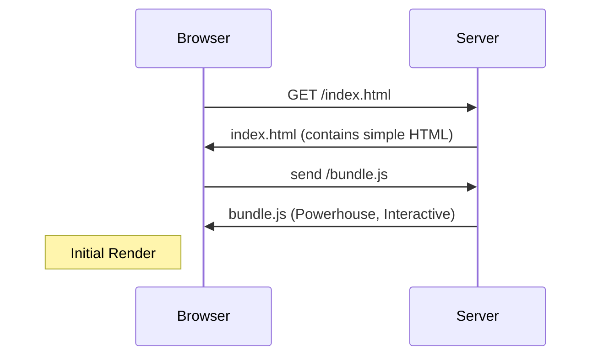
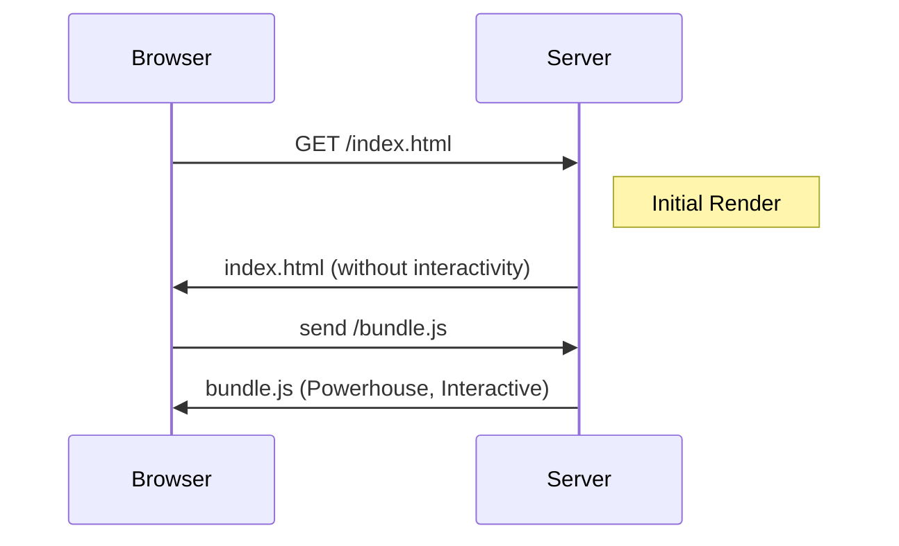
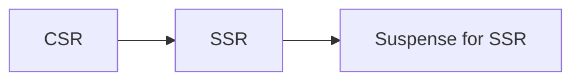

## NextJS

### Templates and Layouts

**Layouts** let developers define a common structure that stays intact across different routes without re-rendering. This is particularly useful for components like headers, footers, and sidebars that should remain consistent as users navigate through the app.

**Templates** in Next.js also act as UI shells that wrap around pages but with a key difference: a template is fully remounted every time a user navigates to a new page.

### Component Hierarchy

```react
<Layout>
    <Template>
        <ErrorBoundary fallback={<Error />>
            <Suspense fallback={<Loading />>
                <ErrorBoundary fallback={<NotFound />}>
                    <Page />
                </>
            </>
        </>
    </>
</>
```

- The error boundary don't catch error thrown by the layout.tsx.
- Move the error.tsx to one level up.
- The root layout doesnot have the parent element or we can't go one level up for root layout.
- We will handle these errors with global-error.tsx
- The global error capture error in production mode.

### Parallel Routes

Routing mechanism which used to render multiple pages simultaneouly within same layout.

Problem Statement: Suppose we have three different components which needs to be loaded simultaneously. We can opt traditional way of declaring components and a parallel approach. The parallel approach has some benifits.

Approach I: With traditional components.

Approach II: With Parallel routes.

- Parallel routes are defined using `slots`.
- To create a slot we need use `@folder` naming convention.


**Pros**

- Parallel routes are great for splitting a layout into managable slots.
- Independent route handling
  - Each slots can handle its own loading and error state.
  - Granular control.
- Sub-navigation.
  - Each slot act as a separate mini application, complete with its own navigation and state management.

### Unmatched Routes in Parallel Routes

Suppose we have 3 slots, and one of the slots navigate to other components, changing the main URL then when user reloads the page it shows 404 Page Not Found Error. Because the url has changed. To solve this issue use `default.tsx`.

### Intercepting Routes

- Allows to load another part of application within a current layout.
- The new component will be loaded like a modal. Refresh the component will take to the actual route.

Intercepting route conventions:

- `(.)` - to match segment on same level
- `(..)` - to match segment on one level up
- `(..)(..)` - to match segment on two level up
- `(...)` - to match segment from the root app dir

### Gallery example - Parallel Intercepted Routes

- When we first load the /gallery url, the next loads the components described in the `layout` file, where modal is returned as null beacause in `default` it is defined as null when initial render. The children will be loaded and all the images will be shown.

- When we click any image, the `@modal` routes intercepts the id.

### Route Handlers

- It helps to build the RESTful endpoints with complete control over the response.
- Think of Express + Node.js.
- External API requests.

### Caching in Route Handlers

- Route handlers are not cached by default.
- Caching works with only GET method.
- When using headers(), cookies() orworking with request object in GET method, caching won't be applied.

### Rendering

### Client Side Rendering (CSR)

The browser transforms React components into what we see on screen the UI.

Drawback:

1. Not great for SEO
2. Performance and UX - Browser do a lot of work, JS bundle bigger and bigger.

**Working**



### Server Side Rendering (SSR)

**Hydration**

React hydration is the process that makes server-rendered HTML interactive on the client side. After the server sends the HTML to the client, React "hydrates" it by attaching event listeners and initializing the state, enabling user interaction. During hydration, React attempts to reuse existing DOM nodes instead of creating new ones, comparing the server-rendered HTML with its virtual DOM and updating as needed

**Working**



**Drawback of SSR: (All or nothing waterfall)**

1. having to load data for the entire page.
2. loading the javascript for the entire page.
3. hydrating the entire page.

**Solution to problem**

Use the Suspense component to unlock two major SSR features:

1. HTML streaming on the server: we dont have to fetch everything before hand. If one section is slow we can delay the initial HTML.
   Even with the faster HTML delivery, we can't start hydrating until we have loaded all the JS for the main section.
   Solution: Code Spliting can be used using React.lazy.
2. Selective hydration on the client.

### The Evolution of React



**Challenges of Suspense for SSR**

1. Large bundle size causing excessive downloads for users.
2. Unnecessary hydration delaying interactivity.
3. Heavy client side processing leading to poor performance.

Solution is RSC.

### React Server Components (RSC)

It leverages the strength of both server and client environments to optimize efficiency, load times and interactivity.

Client Components: Handles user interactivity.

Server Components: Code stays on server.

Benifits of Server Components:

1. Smaller bundle size
2. There is no hydration step, direct access to server side resources
3. Enhanced security
4. Imporved data fetching
5. Caching
6. Faster initial page load
7. SEO improved
8. Efficient streaming: user start seeing content faster instead of waiting for entire page to render on the server.

### Server Rendering Strategies

1. Static Rendering
2. Dynamic Rendering
3. Streaming

**Static:** Building HTML pages when building an application. Once built these pages are cached by the CDN and serve instantly to the users. Ex. Blog posts, e-commerce product listings, documentation and marketing pages. It is a DEFAULT strategy.

<mark>NOTE: In development pages are re-rendered on every request to reflect the latest changes.</mark>

**Dynamic:** Routes are rendered uniqely for each user when they make a request. Eg. To show personalized data when user request data, social media feeds.

Next.js switches automatically to dynamic rendering when it detects a call to a dynamic API/function. For eg.

- cookies()
- headers()
- connection()
- draftMode()
- searchParams prop
- after()

To use dynamic force use:
`export const dynamic = 'force-dynamic'`

### Streaming

- It allows for progressive UI rendering from the server.
- Work is break down into smaller chunks and streamed to the client as soon as they are ready.
- The user can see the parts of the page right away without waiting for everything to load.

### Server and Client Composition Pattern

**Server only code**

It is important to keep server only code separately from client side.

Package: `server-only`, throws build time error if someone import server code into a client component.

### Client Component Placement and Interleaving Server and Client Components

<mark>Important</mark>

- If we have Navbar component and its children has Navlinks and Search components.
- If we make Navbar as client component then by default its children both Navlinks and Search components become client components.
- Therefore we should try to place the client component as far from root possible, ideally a leaf component.

For interleaving:

- Client component nested inside server component ✅
- Server component nested inside client component ❌
  Workaround to get this is using props.

```ts
<ClientComponent>
  <ServerComponent />
</ClientComponent>
```

### Fetching Data from Client and Server Components

- The client function can not be marked as `async`.
- Server components can be marked as `async`.

### Data Fetching Patterns

1. Sequential
2. Parallel

**Sequential Data Fetching:** One fetch depends on results of other.

**Parallel Data Fetching:** Request are eaderly initiated and will load data at the same time.
